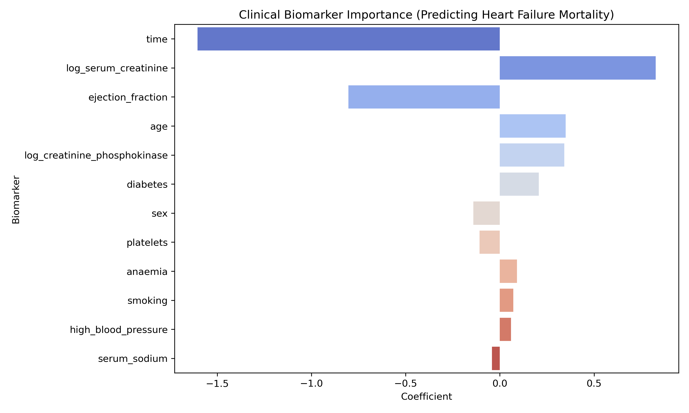
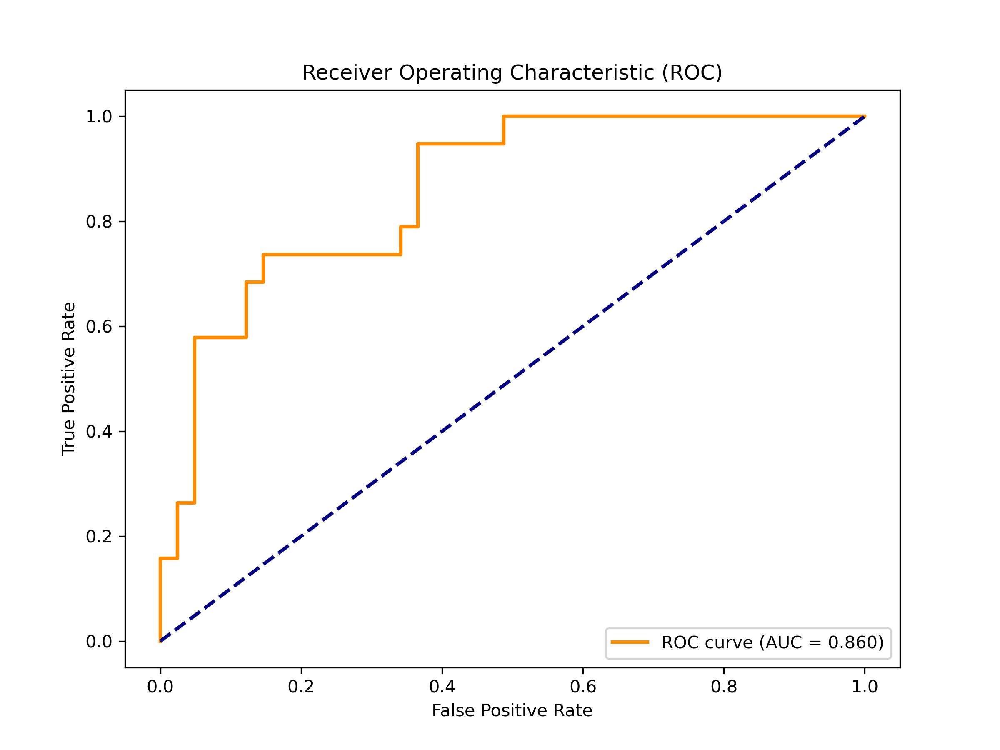

\# Clinical Heart Failure Predictive Modeling

An end-to-end, reproducible machine learning pipeline designed to predict patient mortality (`DEATH\_EVENT`) using clinical biomarkers from the UCI Heart Failure dataset.

\## Project Overview

This repository demonstrates a production-grade Python architecture for clinical predictive modeling. It strictly enforces data leakage prevention through modular preprocessing and isolated scaling, and benchmarks a heavily regularized linear model against a Deep Neural Network.

\*\*Key Biological Insight:\*\* 

In this small-N clinical cohort (299 patients), the L1-Regularized Logistic Regression (ROC-AUC: 0.860) outperformed the PyTorch Deep Neural Network (ROC-AUC: 0.827). This highlights the necessity of constrained, interpretable statistical learning to prevent overfitting in sparse genomic and clinical datasets.

\## Pipeline Architecture

\- `scripts/`: Programmatic data ingestion.

\- `src/heartml/prepare.py`: QC and logarithmic transformation of skewed biomarkers (CPK, Serum Creatinine).

\- `src/heartml/splits.py`: Stratified data partitioning to maintain identical survival ratios across cohorts.

\- `src/heartml/train\_sklearn.py`: `Pipeline`-based Logistic Regression with strict training-only standard scaling.

\- `src/heartml/train\_torch.py`: Feed-forward Neural Network utilizing `BatchNorm1d` and `Dropout` regularization.

\## Reproducibility Guide

To run this pipeline locally and generate the predictive models:

1\. \*\*Install environment:\*\* `python -m pip install -e .`

2\. \*\*Download data:\*\* `python scripts/download\_data.py`

3\. \*\*Clean \& Split:\*\* `python -m heartml.prepare` followed by `python -m heartml.splits`

4\. \*\*Train Models:\*\* `python -m heartml.train\_sklearn` and `python -m heartml.train\_torch`

## Biological Significance & Model Interpretation

Unlike "black-box" deep learning models, the L1-Regularized Logistic Regression provides direct clinical interpretability by zeroing out statistical noise and assigning actionable weights to core biomarkers.

### 1. Clinical Biomarker Importance

**Pathophysiological Insights:**
* **Time (Follow-up period):** The strongest negative predictor, intuitively capturing that patients who survive the acute phase of heart failure and have longer follow-up periods are statistically less likely to die during the study window.
* **Ejection Fraction (Systolic Dysfunction):** Shows a strong negative correlation. Lower left ventricular ejection fraction directly correlates with reduced cardiac output and higher mortality risk.
* **Serum Creatinine (Renal Impairment):** The strongest positive predictor. Elevated serum creatinine indicates worsening renal perfusion (cardiorenal syndrome), a classic hallmark of end-stage heart failure.
* **Age:** Older patient demographic is heavily weighted toward the mortality outcome, aligning with standard clinical frailty indices.

### 2. Receiver Operating Characteristic (ROC)

The linear model successfully discriminates between survival and mortality outcomes with an **AUC of 0.860**, proving that carefully scaled and biologically transformed baseline features (like log-scaled CPK and creatinine) carry sufficient signal without requiring complex multi-layer architectures.

